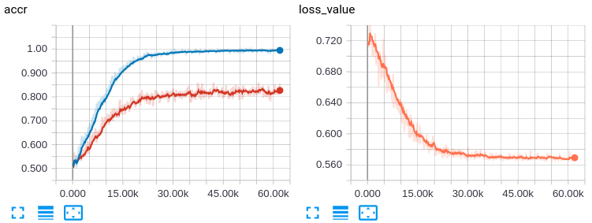

# pathology-TF

### Experiment ###
- train
```
$ python main.py --phase=train --gpu_number=2 --assets=e1000 --epoch=1000
```
- continue train
```
$ python main.py --phase=train --gpu_number=2 --assets=e1000 --epoch=1000 --continue_train=True
```
- test
```
$ python main.py --phase=test --gpu_number=2 --assets=e1000
```

### Result ###
- 4 conv + 1 fully_connected
<p align="center"></p>
